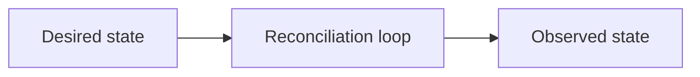
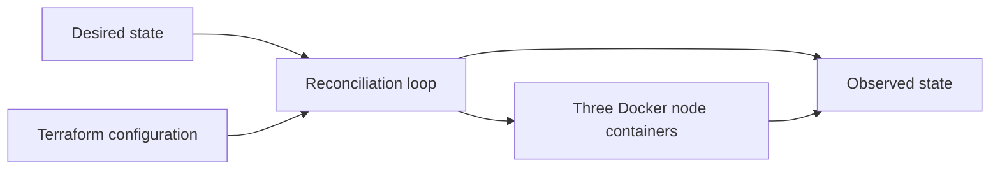
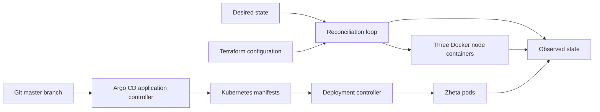

# Zheta Forge: from laptop processes to isolated AWS production

Build and operate a general AI application platform through its complete customer lifecycle, first as five local containers, then on a real multi-node Kubernetes cluster, and finally as three isolated AWS account designs for dev, staging, and production.

The central claim is that production readiness comes from explicit ownership boundaries and observable reconciliation loops, not from adding Kubernetes to a single demo page. The original Terraform, Kind, Kubernetes failure, and Argo CD drift lessons remain below; Zheta Forge adds multiple single-responsibility services and an AWS destination without creating billable infrastructure.

## Start with the product on one laptop

```bash
make product-local   # Build and start the four services plus the visible web page.
make product-smoke   # Prove create-to-delete behavior through HTTP evidence.
make product-stop    # Remove only this repository's Compose containers/network.
```

The smoke run creates a support application, deterministically generates it, previews it, grants machine connector authority, shares and revokes a collaborator, publishes a content-addressed release record, rolls back, exports, retires, and tombstones it. Read [the architecture](docs/architecture.md) for the three authorization planes and [the environment contract](docs/environments.md) for promotion rules.

To run the same service responsibilities on Kind:

```bash
make up
make product-deploy
kubectl -n zheta-forge port-forward service/control-plane 8080:8080
make product-smoke
```

AWS declarations live under `infra/stacks/{dev,staging,prod}`. Each stack targets a different AWS account and EKS cluster. They are reviewable IaC only: this repository never supplies credentials or performs an AWS apply automatically.

This is the single public monorepo used by both courses. The local Kind lab remains under `terraform/`, while product services, Kubernetes/GitOps delivery, and isolated AWS stacks deepen the same running system. See [the stable course snippet index](docs/course-snippets.md). Cloud overlays intentionally render zero service replicas. The candidate public promotion workflow is disabled until its third-party actions are immutably pinned and it produces scan, signature, and SBOM evidence. A separate private-runner command proves the exact AWS account, durable secrets, and cluster identity before it enables replicas. Public ingress/TLS/WAF, live PostgreSQL migration proof, restore proof, authenticated cloud product smoke, and any KEDA or Karpenter installation remain explicit launch vetoes rather than implied features.

The optional [Istio Ambient Mesh boundary](docs/istio-ambient.md) adds source-only namespace enrollment, ztunnel mTLS/L4 policy, a destination waypoint, L7 authorization, and NetworkPolicy compatibility. It is not included by any cloud overlay and does not claim an AWS deployment.

The most important idea is that there is not one magic “Kubernetes recovery” mechanism. Three independent reconciliation loops own three different kinds of desired state:



- Terraform owns whether the local cluster exists.
- Kubernetes owns whether the requested pods exist on available nodes.
- Argo CD owns whether Kubernetes configuration matches this Git repository.

This lab stays local. It does not create AWS, GCP, or paid infrastructure. Kind runs each Kubernetes node as a Docker container, which makes the hardware boundary visible and disposable. Kind's official documentation describes these containers as local Kubernetes “nodes” and supports loading a host-built image into them ([Kind quick start](https://kind.sigs.k8s.io/docs/user/quick-start/)).

## What actually runs

Terraform sends the cluster declaration to the Kind provider. Kind asks Docker for three containers: one control plane and two workers. Inside those containers, kubeadm, kubelet, containerd, and the Kubernetes control-plane components behave like a small cluster.



The [`tehcyx/kind`](https://github.com/tehcyx/terraform-provider-kind) provider is pinned to `0.11.0`. Its cluster resource creates and deletes Kind clusters but does not modify an existing cluster in place, so node-count changes are replacement-oriented rather than a production scaling model.

After the cluster exists, Kubernetes and Argo CD add their own loops without replacing Terraform:



Terraform and Argo CD are complements here. Terraform creates the cluster boundary; Argo CD continuously applies the application configuration inside that cluster. Kubernetes then turns the Deployment into running pods.

## Prerequisites

The lab expects macOS or Linux with:

- Docker Desktop or Docker Engine
- Terraform 1.5 or newer
- Kind 0.32.0 or compatible
- kubectl
- make and Bash

On macOS:

```bash
brew install terraform kind kubectl
open -a Docker
```

Wait until Docker reports that its engine is running, then verify the repository:

```bash
make verify
make check
```

## Demo 1: Terraform, Docker, and Kubernetes failure recovery

### Create the cluster

```bash
make up
```

This runs `terraform init` and `terraform apply`. Terraform records one `kind_cluster` resource in local state. Docker gains these containers:

```text
zheta-local-control-plane
zheta-local-worker
zheta-local-worker2
```

Kubernetes sees the same containers as one control-plane node and two worker nodes. The kubeconfig is isolated at `.kube/config`; the lab does not replace the user's normal kubeconfig.

### Build and deploy Zheta

```bash
make deploy
```

The command performs four distinct operations:

| Code or command | Software effect | Machine/runtime effect | Evidence |
| --- | --- | --- | --- |
| `docker build -t zheta-demo:v1 app` | Builds the Nginx demo image | Stores image layers in the host Docker engine | `docker image inspect zheta-demo:v1` |
| `kind load docker-image ...` | Copies the image into each node's containerd image store | Does not start a pod or create another VM | `docker exec <node> crictl images` |
| `kubectl apply -k .../base` | Stores Namespace, Deployment, and Service desired state | Scheduler selects Docker-backed worker nodes | `kubectl -n zheta get deployment,pods -o wide` |
| Deployment controller creates two replicas | Reconciles two pod objects | Container processes consume the Docker VM's CPU and RAM | Two Ready pods and Service endpoints |

Serve the application in one terminal:

```bash
make serve
```

Open [http://localhost:8080](http://localhost:8080).

### Visualize the system

Keep this running in a second terminal:

```bash
make watch
```

The dashboard refreshes every two seconds and joins the three useful views:

- Docker containers that act as machines
- Kubernetes nodes and pods
- Argo CD sync/health state when installed

For a single non-refreshing snapshot:

```bash
WATCH_ONCE=1 make watch
```

### Delete a pod

```bash
make kill-pod
```

The script resolves exactly one pod with the Zheta label, deletes it, and waits for the Deployment to become available again. Terraform does nothing because the cluster still exists. Argo CD does nothing because the Deployment manifest still matches Git. The Kubernetes Deployment controller creates the replacement.

Decision rule: a missing instance of an existing Deployment is Kubernetes runtime drift, not infrastructure drift and not Git drift.

### Stop a simulated machine

```bash
make node-down
```

The script validates that `zheta-local-worker` has both the expected Kind cluster label and worker role before stopping it. Docker removes one running node container from the available machine set. Kubernetes eventually reports the node unavailable; pod movement follows Kubernetes node-health and toleration timing rather than happening instantly.

Restore the same simulated machine:

```bash
make node-up
```

The container restarts, its kubelet reconnects, and the script waits for the Kubernetes Node condition to become Ready.

This is a laptop failure simulation, not a high-availability test. All Kind nodes ultimately share one Docker Desktop VM, one laptop, one power source, and one disk.

## Demo 2: Argo CD and Git drift recovery

Argo CD is installed from the official non-HA manifest pinned to `v3.5.0`. The Argo CD project publishes versioned installation manifests and recommends supported release lines rather than an unpinned `latest` URL ([Argo CD releases](https://github.com/argoproj/argo-cd/releases), [security policy](https://github.com/argoproj/argo-cd/security/policy)).

### Install Argo CD and create the Application

The repository must already be pushed publicly so Argo CD can clone it without a credential Secret.

```bash
make argocd-up
```

This command:

1. Builds and loads the local Zheta image.
2. Installs Argo CD into the `argocd` namespace.
3. Applies `argocd/application.yaml`.
4. Argo CD clones `master` and renders `gitops/apps/zheta/overlays/dev`.
5. Argo CD applies the three-replica overlay and waits for `Synced` and `Healthy`.

No Argo CD password is needed for this terminal-first demo. The Kubernetes `Application` custom resource exposes the sync and health evidence through `kubectl`.

### Create live drift and watch Argo CD repair it

```bash
make drift
```

The script deliberately changes the live Deployment from Git's three replicas to one:

```bash
kubectl -n zheta scale deployment/zheta --replicas=1
```

Argo CD's automated `selfHeal` notices that the live object no longer matches the rendered Git object and restores three replicas. The script prints each observed replica count and sync state until both are correct.

| Failure or change | Owner that reacts | Expected recovery |
| --- | --- | --- |
| One pod is deleted | Kubernetes Deployment controller | Creates a replacement pod |
| One Kind worker container stops | Docker/Kubernetes node lifecycle | Node becomes unavailable; restart it with `make node-up` |
| Deployment replicas changed with `kubectl scale` | Argo CD | Restores the Git value of three |
| Cluster is destroyed | Terraform | Recreates it only after another `make up` |
| Git overlay changes from three to four | Argo CD, after push | Applies four as the new desired state |

Decision rule: use the owner of the desired state to diagnose recovery. Do not use Terraform to replace a missing pod, and do not expect Argo CD to recreate a destroyed cluster.

## Repository map

```text
app/                         Docker image for the visible Zheta page
terraform/                   Kind cluster desired state
gitops/apps/zheta/base/      Reusable Kubernetes resources
gitops/apps/zheta/overlays/  Argo CD's three-replica development state
argocd/application.yaml      Git repository-to-cluster contract
scripts/watch.sh             Joined terminal dashboard
scripts/failure.sh           Validated pod/node failure actions
scripts/gitops-drift.sh      Argo CD self-heal demonstration
```

## Clean up

Recover the worker first if it is stopped, then let Terraform delete only the cluster it owns:

```bash
make node-up   # safe to skip when the node is already running
make destroy
```

`terraform destroy` removes the Kind node containers and repository-local kubeconfig-backed cluster. The host's Docker images may remain cached; this lab does not run broad cleanup commands such as `docker system prune`.

## Reusable troubleshooting sequence

1. **Observe:** run `WATCH_ONCE=1 make watch`.
2. **Locate ownership:** cluster, node, Kubernetes object, or Git state.
3. **Inspect the authoritative declaration:** Terraform HCL, Docker node, Deployment, or Argo CD Application.
4. **Apply the smallest recovery:** `make up`, `make node-up`, let the Deployment replace a pod, or let Argo CD self-heal.
5. **Measure:** require Ready nodes, available replicas, `Synced`, `Healthy`, and an HTTP response.

The lab is successful when you can predict which loop reacts before running the failure command.
