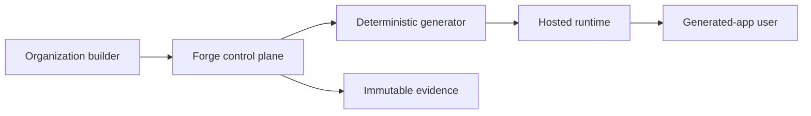

# HelixWorks architecture

HelixWorks is not one generated web page. It is a bounded platform that turns an organization-owned blueprint into a content-addressed release record while keeping provider administration, hosted runtime, and generated-application authority independently revocable.

The smallest useful request path is builder to control plane to generator to runtime. Evidence is separate because an API response alone cannot prove who acted, against which organization, or which release was deployed.

## Complete customer lifecycle

| Step | Product action | Owning boundary | Durable evidence |
| --- | --- | --- | --- |
| Create | Create an organization-scoped blueprint | provider control plane | project identity and actor |
| Generate | Produce the same artifact for the same blueprint | generator, artifact store | content digest |
| Preview/interact | Deploy an unpublished artifact | hosted runtime | preview deployment identity |
| Managed data | Store tenant-scoped deployment metadata | hosted runtime boundary | tenant and app composite key |
| Connect | Grant a machine identity to one connector | provider control plane | independently revocable grant |
| Identify | Resolve organization actor and role | provider identity boundary | accepted or denied actor/scope |
| Share/revoke | Change collaborator access | provider control plane | grant or revocation event |
| Publish | Bind a digest-addressed artifact to a recoverable release state | hosted runtime | release, artifact, idempotency, and deployment state |
| Change/rollback | Deploy a new digest or restore an old release | hosted runtime | deployment/rollback event |
| Operate/support | Observe health, denial, and recovery | evidence service | timestamped evidence ID |
| Export/retire/delete | Return owned metadata, stop runtime, then erase control state | owning service at each boundary | export, retirement, deletion events |

Connector machine authority is taught first: an administrator grants a service identity such as `crm-reader`. A future delegated user grant would be a distinct record; it would not inherit the service grant or make the provider actor an end user inside a generated application.

## Responsibility and dependency direction

The control plane contains workflow policy and depends on small interfaces for generation, runtime deployment, and evidence. Concrete HTTP clients are injected at startup. This inversion of control keeps the domain testable without containers and prevents transport details from owning business rules.

- `control_plane`: organizations, projects, collaborators, connector grants, releases, lifecycle policy.
- `generator`: a deterministic source transformation; it cannot publish or grant access.
- `runtime`: preview and published deployment state; it cannot change provider membership.
- `evidence`: append-only observations; it cannot authorize the action it records.

For local learning these stores are durable SQLite files and a local broker with independent subscriber acknowledgements. They prove restart, tombstone, idempotency, and fan-out behavior on one machine; they do not prove multi-host PostgreSQL, S3, SNS/SQS, backup restore, or generated-application business-data authorization. AWS declarations provision those managed boundaries, but launch stays blocked until private-runner and live integration proofs exist.

The current runtime owns deployment metadata and generated source delivery. It does not yet implement arbitrary generated-application business tables, end-user sessions, or row-level authorization. Course material must treat those as a bounded platform extension, not as shipped behavior.

## From declaration to physical reality

| Declaration | Interpreter | Software state | Hardware effect | Evidence |
| --- | --- | --- | --- | --- |
| `compose.yaml` | Docker Compose | five container processes and a private network | laptop CPU, RAM, disk, ports | health endpoints and lifecycle smoke output |
| Kustomize base + overlay | Kustomize and Kubernetes API | Deployments, Services, policies | containers scheduled onto Kind or EKS nodes | Ready pods, endpoints, rollout status |
| Argo CD ApplicationSet | ApplicationSet and application controllers | one Application per registered environment cluster | controllers use cluster network and CPU | Synced/Healthy plus Git revision |
| Terraform environment module | Terraform AWS provider | VPC, EKS, Aurora, S3, SQS, ECR, KMS | AWS network, compute, disk, and control-plane capacity | reviewed plan, resource IDs, Kubernetes nodes |

Decision rule: diagnose at the owner of the missing desired state. Terraform cannot repair a pod, Kubernetes cannot recreate a deleted VPC, and a healthy Argo Application cannot prove that an unreachable EKS API is healthy.
