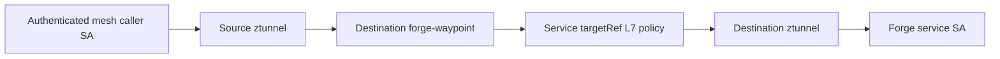

# Istio Ambient Mesh for Zheta Forge

This slice adds an optional, fail-closed service-mesh boundary to the existing monorepo. It does not add another product, repository, or business authority. The domain model, MVC controller, injected adapters, transactional outbox, and Pub/Sub contracts remain unchanged.

## What is pinned and what is proven

Istio `1.30.3` is pinned because it is the current patch release as of 2026-08-11. The official [1.30.3 release announcement](https://istio.io/latest/news/releases/1.30.x/announcing-1.30.3/) identifies it as the latest robustness patch. Istio's [production-oriented Ambient Helm guide](https://istio.io/latest/docs/ambient/install/helm/) requires Gateway API CRDs before a waypoint and currently uses Gateway API `v1.5.1`. `mesh/istio-ambient/versions.env` pins both versions and the downloaded CRD bundle's SHA-256.

Source rendering and static policy checks are proven locally. No Istio control plane, EKS cluster, AWS account, live mTLS session, denial, failover, or rollback was exercised by this commit.

## Authority and traffic path



- The cluster platform owner installs Gateway API, `istio-base`, `istiod`, `istio-cni`, and `ztunnel`.
- The Forge owner enrolls only `zheta-forge`, owns `forge-waypoint`, and attaches destination policies.
- Kubernetes ServiceAccounts remain the workload identity source. On EKS, the existing Pod Identity associations remain the separate AWS authorization source; SPIFFE identity does not grant AWS permissions.
- ztunnel enforces strict mTLS and the L4 source-principal rule. The waypoint enforces HTTP method/path rules attached with `targetRefs` to destination Services.
- NetworkPolicy remains CNI-owned defense in depth. Ambient does not bypass it.

The L4 policy deliberately accepts the waypoint identity at application workloads. This prevents direct waypoint bypass after all Forge sources are ambient. L7 policy still evaluates the original caller identity at the waypoint.

Customer ingress remains blocked in this slice. There is no ingress Gateway, public load balancer, DNS, certificate, WAF, or approved ingress ServiceAccount. Applying the ambient overlay before that authority exists makes the control-plane API reachable only through an enrolled destination waypoint path. This is an explicit launch veto, not an ingress implementation. Do not add an unauthenticated principal merely to make a smoke command pass.

## NetworkPolicy compatibility

Ambient uses HBONE TCP `15008`, so the component patches the existing application ingress policies to admit that overlay port. Istio's [Ambient NetworkPolicy guide](https://istio.io/latest/docs/ambient/usage/networkpolicy/) also requires allowing its health-probe SNAT sources. The component admits exactly `169.254.7.127/32` and `fd16:9254:7127:1337:ffff:ffff:ffff:ffff/128`; otherwise kubelet probes can fail after enrollment. The waypoint has its own bounded ingress/egress policy because Istio does not create NetworkPolicy for Gateway API-managed waypoints.

## Bounded local workflow

The default local/dev/staging/prod overlays remain unchanged. To render the opt-in local composition:

```bash
kubectl kustomize gitops/apps/forge/overlays/ambient-local
bash scripts/verify-ambient-source.sh
```

Installation mutates a cluster and therefore requires an exact current context and explicit approval:

```bash
MESH_CONTEXT=zheta-local MESH_INSTALL_APPROVED=1 bash scripts/install-istio-ambient.sh
kubectl --context zheta-local apply -k gitops/apps/forge/overlays/ambient-local
MESH_CONTEXT=zheta-local bash scripts/verify-istio-ambient.sh forge
```

Failure drills delete exactly one validated ztunnel or waypoint pod and wait for its controller:

```bash
kubectl --context zheta-local -n istio-system get pods -l app=ztunnel \
  -o custom-columns=NAME:.metadata.name,UID:.metadata.uid,NODE:.spec.nodeName
MESH_CONTEXT=zheta-local MESH_FAILURE_APPROVED=1 \
  TARGET_POD=REVIEWED_NAME TARGET_POD_UID=REVIEWED_UID \
  bash scripts/failure-istio-ambient.sh ztunnel-recovery
```

Use the same explicit name/UID process with the label `gateway.networking.k8s.io/gateway-name=forge-waypoint` for the waypoint drill. Each drill checks the Kubernetes API and an unaffected product Deployment before mutation, validates owner kind and UID, proves a different replacement UID, and executes an internal control-plane-to-generator request after recovery.

Rollback supports only the local overlay. It first proves the namespace is enrolled exactly as expected, removes enrollment and Forge-owned mesh resources, reapplies the local base NetworkPolicies, waits for every product Deployment, and proves an internal product request. Shared Istio releases and Gateway API CRDs are always preserved because they have a separate cluster owner.

## AWS and EKS mapping

The same Helm sequence can run from a private runner that reaches each private EKS API. Before any account is changed, the environment owner must separately prove:

1. exact AWS account, region, EKS context, and change approval;
2. the selected Kubernetes version is supported by Istio 1.30;
3. the EKS CNI/network-policy implementation admits HBONE and both health-probe addresses;
4. node kernel/CNI prerequisites, Pod Security admission, capacity, disruption budgets, and ztunnel-per-node recovery;
5. EKS Pod Identity associations remain scoped to the five existing application ServiceAccounts;
6. an approved ingress identity and destination-waypoint route exist before customer traffic;
7. live positive/negative L4 and L7 authorization evidence, mTLS telemetry, waypoint bypass denial, rollback, and cost evidence.

Nothing in Terraform or the cloud overlays installs Ambient Mesh. That separation prevents an unreviewed application promotion from gaining cluster-scoped mesh authority.
